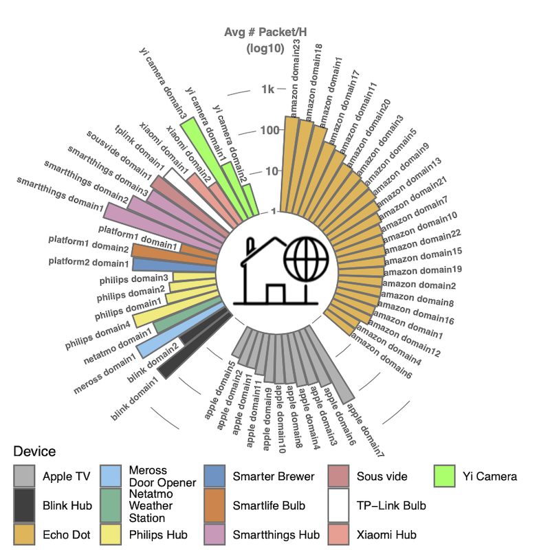

# A Haystack Full of Needles: Scalable Detection of IoT Devices in the Wild

This site contains the signatures of the IoT devices accompanying the paper "A Haystack Full of Needles: Scalable Detection of IoT Devices in the Wild" in proceedings of the ACM Internet Measurement Conference 2020 (IMC 2020), October 2020, Virtual Event. 

The official paper can be found at https://moniotrlab.ccis.neu.edu/imc20/. 

## Signatures of IoT devices

We first identify the set of IoT domains that can be monitored (**detection level**). We then generate the rules for detecting IoT devices (**detection rules**).

* `detection_level/` - Data for Section 4.3.1 Determining IoT Detection Level - Depending on the set of IoT services contacted by the devices we generate device detection rules at three granularity levels: (i) Platform-level, (ii) Manufacturer-level, and (iii) Product-level. Considering the diverse range of products from Amazon and Samsung, we release the list of domains/ports for those device separately, for a total of three files:
	* _alexa_enabled_: for devices using Alexa voice service
	* _samsung_IoT_: for Samsung IoT devices
	* _other_devices_: for the remaining 32 device types

Each file contains 6 columns: 

	- domain: domain contacted by the device
	- detection_level: super category (Platform-level, Manufacturer-level, Product-level) 
	- device: device name
	- grouped_domain: we group (and rename) different domains associated to the same service IP on which the domains are hosted during the time period of our experiments (see section 4.2.1 of the paper for further details).
	- domain_id: unique id for the grouped domain
	- port: destination port
* `detection_rules/` - Data for Section 4.3.2 Generation of Detection Rules -
* `README.md` - This file contains an overview of the data.
* `imc20_logo.png` - A circular bar plot of average # of packets/hour per domain.

## From IoT-Specific Domains to Service IPs

Considering that in the wild, we can only
observe standard network level features such as src/dst IP and port
numbers (without packet payload), we needed to identify all associated service IPs
on which the domains are hosted during the time period of our
experiments.
To this end, we used both the ground truth experiments (DNS queries), DNSDB, Censys, and applying additional
filters.

For further details see Section 4.2 of the paper.
